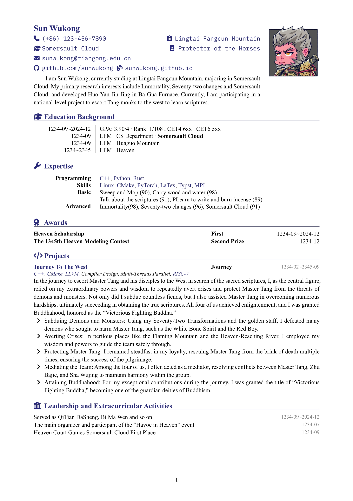
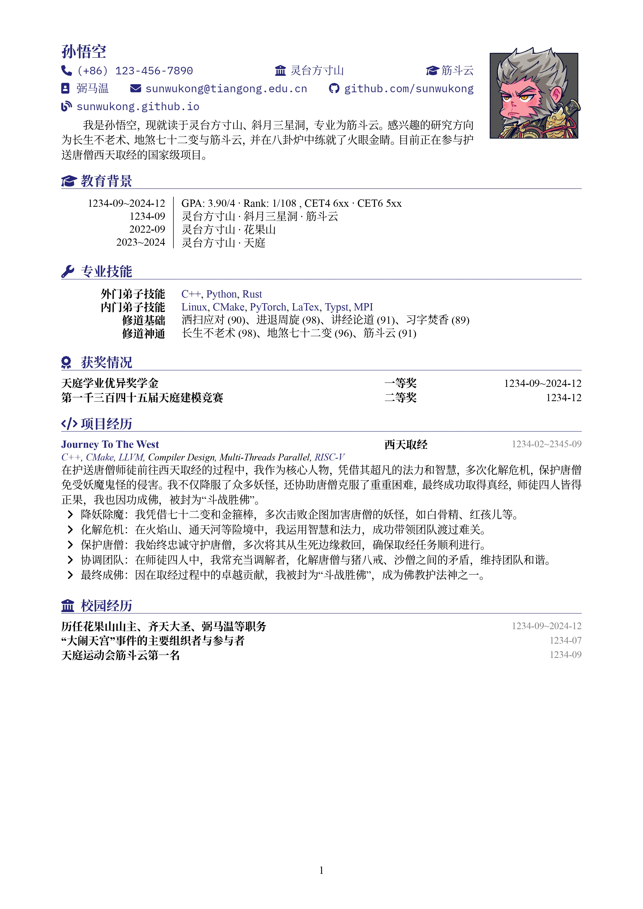

# Resume Template in en/zh

> :star: If it is useful for you, please give me a free star, thanks! :star:

Modified from [OrangeX4/Chinese-Resume-in-Typst](https://github.com/OrangeX4/Chinese-Resume-in-Typst).

Extract Personal Infomation to another file, keep main typst resume file clean.

- `resume_en.typ`
- `resume_zh.typ`
- `template.typ`: base template.
- `Icons.typ`: import icons from ./icons folder.
- `OuterInfos.typ`: Info about programming languages, tools, etc.
  - can be include and use in other resume files.
- `PersonalInfos.typ`: Info about personal, including name, contact, education, experience, skills, etc.
- `Awards.typ`: Info about awards.
- `Extracurriculars.typ`: Info about extracurriculars.
- `Projects.typ`: Info about projects.

Examples:

